# Welcome to Coding with AI (Winter 2026)
## Student Setup Guide: Get Ready Before Day 1

---

## Overview

Before the first class session, you'll need to:
1. **Access course materials** on GitHub
2. **Set up Google Colab** (our coding environment)
3. **Connect your Google Drive** to Colab (for saving your work)
4. **Redeem your Google Cloud educational credits** (so you can experiment without fretting about the cost. Much.)
5. **Establish your Google Cloud project** (so your work is billed to those credits)


This guide walks you through each step. **Estimated time: 30-40 minutes**

**Key Concept:** You'll be working entirely in Google Colab, a cloud-based Jupyter notebook environment. Your notebooks are stored in your personal Google Drive, so all your work is automatically saved and accessible from any device.

---

## Part 1: Accessing Course Materials on GitHub

### Step 1: Create a GitHub Account (if you don't have one)
- Go to [github.com](https://github.com)
- Click "Sign up" in the top-right corner
- Follow the registration process (email, password, username)
- Verify your email address

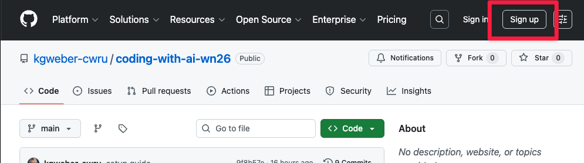

### Step 2: Navigate to the Course Repository
- Open this link in your browser: [github.com/kgweber-cwru/coding-with-ai-wn26](https://github.com/kgweber-cwru/coding-with-ai-wn26)
- You should see a folder-like structure with course materials
- Look for the "week-0" folder

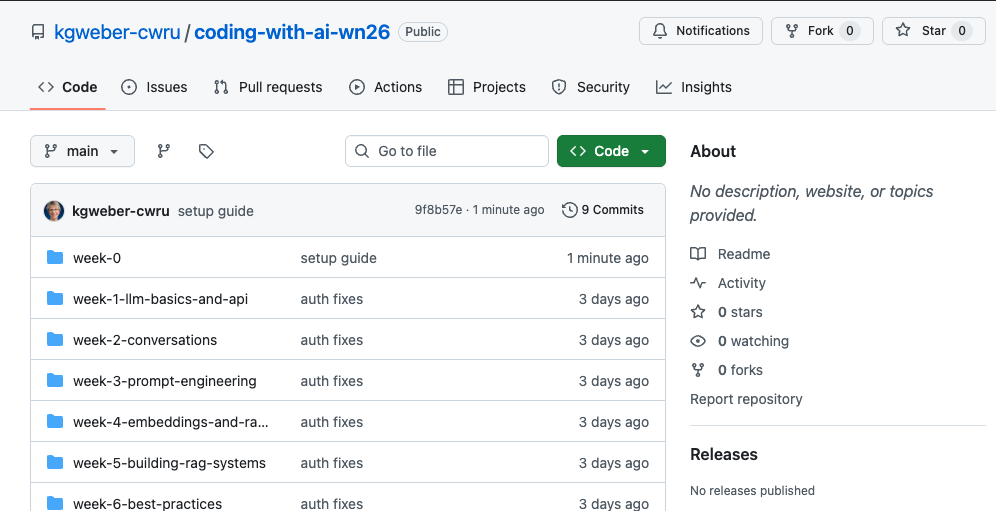

### Step 3: Star the Repository (Optional)
- Click the **"Star"** button (top-right of the repository)
- This saves the repository to your GitHub profile so you can easily find it later.

---

## Part 2: Set Up Google Colab

### What is Google Colab?
Google Colab is a **free, cloud-based coding environment** where you can write and run Python code directly in your browser. You don't need to install anything on your computer - everything runs on Google's servers.

**Why we use it:**
- ✅ Integrated with Google Drive (easy saving)
- ✅ GPU access for AI/ML projects (free tier available)
- ✅ Pre-installed libraries for machine learning
- ✅ No setup needed - works immediately
- ✅ Easy sharing and collaboration

### Step 1: Use your CWRU Google Credentials
You'll use your CWRU Google account to use Colab (Your everyday CWRU Gmail, etc. account. You'll also use this for Drive and Google Cloud Platform (GCP)).

### Step 2: Access a Notebook from GitHub
1. Go to the course repository if you aren't already there: [github.com/kgweber-cwru/coding-with-ai-wn26](https://github.com/kgweber-cwru/coding-with-ai-wn26)
2. Navigate to `week-0`
3. Click on **setup_verification.ipynb** (or any `.ipynb` file you want to open)
4. You'll see a preview of the notebook in GitHub


### Step 3: Open Notebook in Google Colab
**Method 1: From GitHub (Recommended)**

In the GitHub preview of the `.ipynb` file, look for the **Colab badge/button** at the top of the notebook:
- Click the **"Open in Colab"** button (or similar badge)
- The notebook will automatically open in Google Colab in a new tab

**Method 2: Manual Link**

If you don't see the badge, you can construct the link:
- Replace `github.com` with `colab.research.google.com/github` in the URL
- Example: `https://colab.research.google.com/github/kgweber-cwru/coding-with-ai-wn26/blob/main/week-0/setup_verification.ipynb`

### Step 4: Review the Notebook in Colab
- The notebook is now open in Colab, but it's **read-only** (you can't edit it yet)
- This is a view of the original from GitHub
- Scroll through to see what you'll be working on
- ✅ If you can read the code and explanations, you're all set!

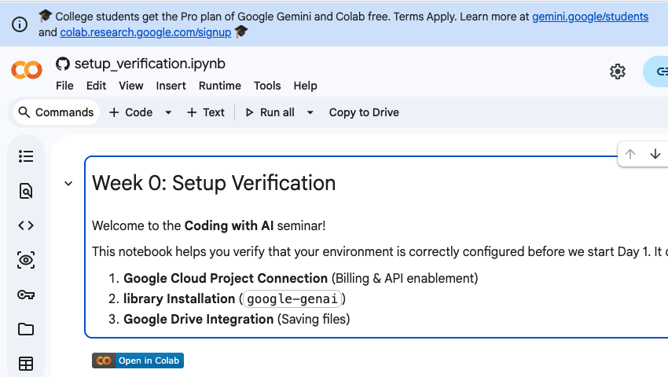


‼️ Important! You may see a banner offering you student pricing for Google products. 
**DO NOT** take them up on this offer yet! We don't want that offer tangled up 
with the student credits that come with this seminar.

---

## Part 3: Save Your Working Copy to Google Drive

### Why Make a Copy?
The GitHub notebook is the "master copy." When you open it, you're viewing the original. To write your own code and save your progress, you need to save a **copy to your Google Drive**.

### Step 1: Save a Copy to Drive
1. In Colab, go to **File** → **Save a copy in Drive**
2. A dialog will pop up asking where to save
3. Choose where in your Drive (or just accept the default: `Colab Notebooks` folder)
4. Click **OK**

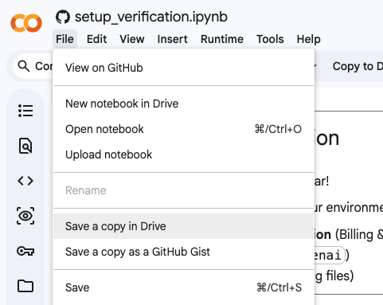*

### Step 2: Switch to Your Copy
- A new tab will automatically open with **your personal copy**
- Notice the file name changes to something like "Copy of setup_verification.ipynb"
- **This is now YOUR notebook** - all your changes save automatically to your Drive
- You can edit the code, add notes, run experiments

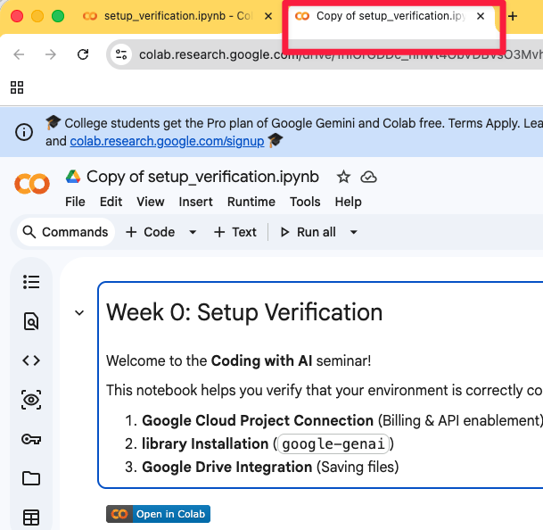

### Step 3: Rename Your Copy (Optional but Recommended)
1. Click the filename at the top of Colab ("Copy of setup_verification.ipynb")
2. Edit it to something clear like "Week0-[YourName]"
3. Press Enter to save the new name


### Step 4: Verify Your Copy is in Drive
1. Go to [drive.google.com](https://drive.google.com) in a new tab
2. Look for your notebook file (should be in "Colab Notebooks" folder or where you saved it)
3. ✅ Your copy is safely stored in your Drive and will persist between sessions

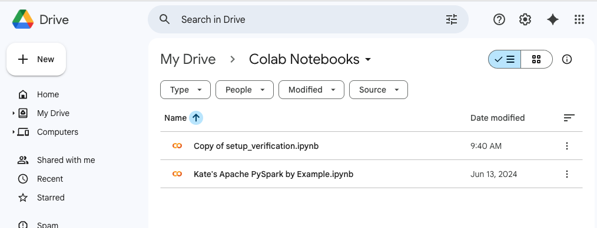
---

## Part 4: Connect Google Drive to Colab (For File Access)

### Why Connect Drive to Colab?
As you progress through the seminar, you'll work with datasets, save results, and manage files. Connecting Drive allows your Colab notebooks to access files from your Drive directly.

### Step 1: Mount Google Drive in Your Notebook
In your Colab notebook, run the code in the "Step 1: Test Google Drive Connection" section. You may get a warning that Google didn't write this notebook. That's OK. Select `Run Anyway`.


### Step 2: Run the Cell
1. Click the **Play button** (▶) next to the cell
2. A popup will appear asking for permission
3. Click **"Connect to Google Drive"**
4. Select your Google account
5. Click **"Allow"** to give Colab permission to access your Drive

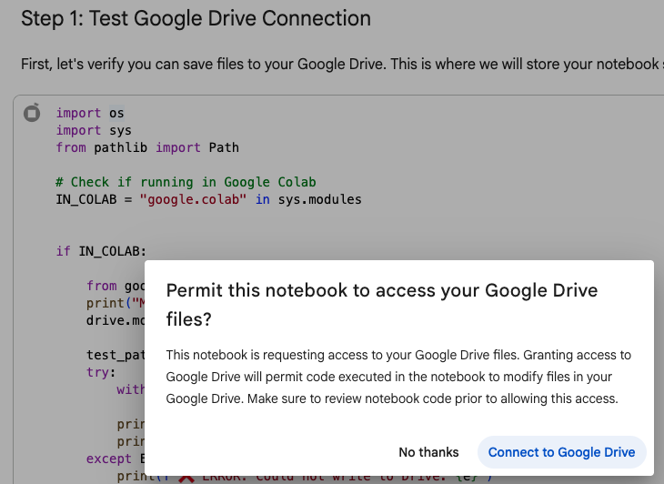

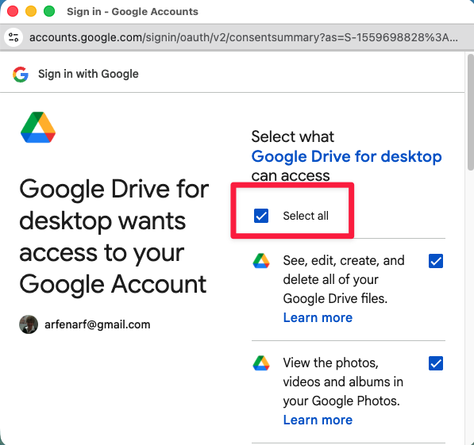

### Step 3: Verify Connection
After clicking "Allow," you should see:
```
Mounting Google Drive...
Mounted at /content/drive
✅ SUCCESS: Successfully wrote to /content/drive/My Drive/cwru-setup-test.txt
Check your Google Drive for this file!
```

This means your Drive is now connected and accessible to your code.


### Step 4: Access Your Drive Files
Now your notebook can read and write files to your Drive. You could execute calls like this:
```python
# Example: Read a file from your Drive
import pandas as pd
df = pd.read_csv('/content/drive/My Drive/my_file.csv')

# Example: Save a file to your Drive
df.to_csv('/content/drive/My Drive/my_results.csv')
```

You'll learn more about this in the seminar, but the key point: **your notebook can now access your Drive files!**

---

## Part 5: Redeem Your Google Cloud Educational Credits

### What Are These For?
We have provided **$50 in Google Cloud educational credits** for this course. These credits enable you to:
- ✅ Use Gemini 3 (advanced features)
- ✅ Run experiments with higher rate limits
- ✅ Access all premium Google AI services
- ✅ Scale your projects beyond free tier limits

Your credits will remain valid for a year after the seminar starts, so you're free to continue to use them to experiment and try new things.

**This course uses Vertex AI (built on Google Cloud), so you MUST redeem your credits to play!**

### How to Redeem

**Step 1: Request your coupon**
You will receive an email with a link to a form that allow you to request a coupon code. You will see a page like this:

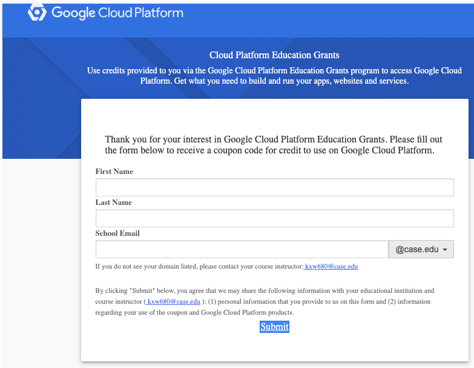

Google will email you your code.

**Step 2: Navigate to Google Cloud Console**
1. Go to  https://console.cloud.google.com/education to redeem your coupon code
2. Sign in with your Google account

**Step 3: Redeem Your Coupon**
1. Enter your first and last names and verify your email
2. Paste your coupon code
3. Click **"Accept and continue"**
4. Complete the billing account setup (requires payment profile, but NO credit card is needed for student coupons)


**Step 4: Verify Your Credits**
1. Go to **Billing** → **Billing Account for Education** → **Credits**
2. You should see your credit balance (e.g. $50) applied to a new Billing Account (often named for the course)


---

## Part 6: Set Up Your Google Cloud Project

### Why do I need a Project?
In Google Cloud, all resources (like the Gemini model) live inside a "Project". The project tracks your files, who has access, and importantly, **billing** (which your credits will cover).


### Step 1: Create a New Project
1. Go to [console.cloud.google.com](https://console.cloud.google.com)
2. Click the **project selector dropdown** (top left, next to "Google Cloud" logo)
3. Click **"New Project"** (top right of the popup window)
4. **Project Name:** `coding-with-ai-winter26` (or similar)
5. **Organization:** Leave at `case.edu`
6. Click **Create**


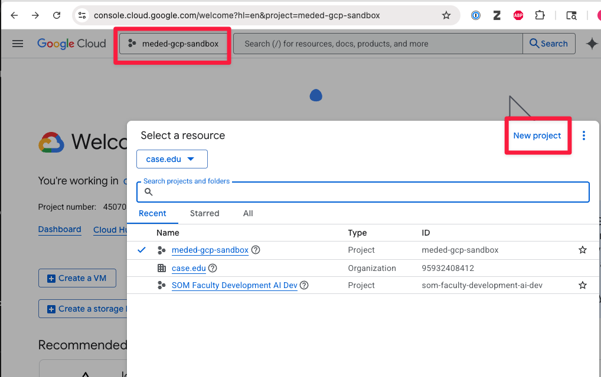

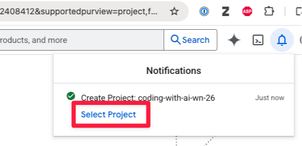

### Step 2: Enable the Vertex AI API
Your project needs permission to use the AI models.
1. Ensure your new project is selected in the top dropdown.
2. In the search bar at the very top, type: `Vertex AI API`
3. Select **"Vertex AI API"** (Marketplace result)
4. Click **"Enable"**
5. Wait a moment for it to finish.

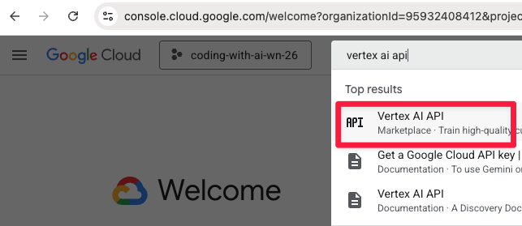

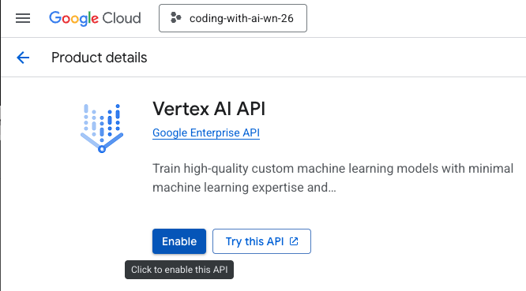

### Step 3: Get Your Project ID (Critical!)
You will need your **Project ID** to configure your notebook. Note that **Project ID** is often different from **Project Name** (it may have numbers added).

1. Click the **Google Cloud Logo** (top left) to go to the Dashboard.
3. Find **"Project ID"** (e.g., `coding-with-ai-wn26-4123`).
4. **Copy this ID** and save it somewhere accessible (or just remember where to find it).

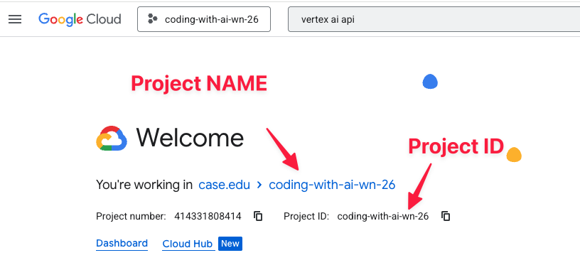

---

## Quick Verification Checklist

Before Week 1 begins, confirm you have completed:

- [ ] Created or verified GitHub account
- [ ] Accessed the course repository at [github.com/kgweber-cwru/coding-with-ai-wn26](https://github.com/kgweber-cwru/coding-with-ai-wn26)
- [ ] Opened a notebook in Google Colab (`setup_verification.ipynb`)
- [ ] Saved a copy of a notebook to your Google Drive
- [ ] Redeemed Google Cloud educational credits using your coupon code
- [ ] Created a new Google Cloud Project with billing linked
- [ ] Enabled the "Vertex AI API" in your project
- [ ] Located your "Project ID" (e.g., `my-project-123`)
- [ ] Successfully executed each cell in the `setup_verification.ipynb` notebook


---

## Troubleshooting

### "I can't access the GitHub repository"
- **Check:** Are you using the correct link? [github.com/kgweber-cwru/coding-with-ai-wn26](https://github.com/kgweber-cwru/coding-with-ai-wn26)
- **Solution:** The repository is public - no special access required. Try clearing your browser cache and refreshing.

### "I don't see an 'Open in Colab' button on the notebook"
- **Solution:** Use the manual link method (Part 3, Method 2) to open the notebook
- **Or:** Contact Kate Weber to add the Colab badge to the repository

### "I can't save a copy to my Drive"
- **Check:** Are you logged into your Google account?
- **Check:** Do you have space available in Google Drive?
- **Solution:** Try clearing your browser cache and logging in again

### "When I mount Google Drive, I get a permission error"
- **Solution:** Check that you're using the correct code: `from google.colab import drive` and `drive.mount('/content/drive')`
- **Check:** Did you click "Allow" when the permission dialog appeared?

### "My coupon code isn't working"
- **Check:** Did you copy the code exactly (no extra spaces)?
- **Check:** Has the coupon already been used? Each code is single-use.
- **Solution:** Contact Kate

### "I can't find my Project ID"
- **Solution:** go to [console.cloud.google.com](https://console.cloud.google.com), make sure your project is selected in the top bar, and check the Project info on the dashboard.

### "PermissionDenied or 403 Error when running code"
- **Check:** Did you run the authentication cell (`auth.authenticate_user()`)?
- **Check:** Did you enable the **Vertex AI API** in your project? (Part 6, Step 2)
- **Check:** Did you enter the correct **Project ID** when prompted?

### "Notebooks beyond this week aren't running correctly"

* We're building this plane while we're flying it, friends
---

## Support

**Questions?** Contact Kate Weber at kate-weber@case.edu

**Google Colab Help:** [support.google.com/colab](https://support.google.com/colab)

**GitHub Help:** [docs.github.com](https://docs.github.com)

**Google Gemini API Help:**
- API Documentation: [ai.google.dev/docs](https://ai.google.dev/docs)
- Gemini Models Guide: [ai.google.dev/models](https://ai.google.dev/models)
- Pricing & Credits: [ai.google.dev/pricing](https://ai.google.dev/pricing)

---

## Welcome! You're Ready!

Once you've completed all steps above, you're set for Day 1. 

**A few final tips:**
- All your work is automatically saved in Google Drive - no need to worry about losing code!
- You can access your notebooks from any computer with a browser
- If you need help during the seminar, ask - we're here for you!

**See you soon!**

